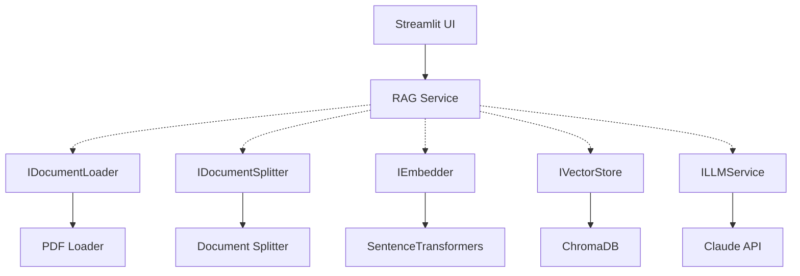

# 🌱 ESG Insight RAG Assistant

A RAG application for querying complex ESG reports — turning dense sustainability PDFs into an interactive Q&A interface.

**Python:** 3.11 | **Architecture:** Hexagonal (Clean Architecture) | **LLM:** Claude (Anthropic API) | **Stack:** LangChain · ChromaDB · RAGAS

## 📹 Demo
[▶ Watch the demo](https://www.loom.com/share/337e70ef92c7402c8dafa58ebed20587)

---

## 🏗️ Architecture

Hexagonal Architecture (Ports & Adapters) — the core `RagService` has zero knowledge of external tools. Swapping ChromaDB for Pinecone, or Claude for GPT-4, requires only a new Adapter.


---

## 🧠 Design Decisions

**Why Hexagonal Architecture?**
Business logic is fully decoupled from infrastructure. The core `RagService` is testable by mocking adapters without a real DB or LLM running.

**Why build RAG manually first, then migrate to LangChain?**
Building the pipeline from scratch proves understanding of *why* RAG works — vector math, retrieval logic, prompt construction. LangChain was added deliberately in v2 to enable LCEL chains and RAGAS evaluation — not as a shortcut.

**Chunking strategy**
Recursive character splitting (chunk size 1000, overlap 200). The overlap handles chunk-boundary answers — semantic splitting was tested but not justified given the embeddings model's robustness.

---

## 🔄 LangChain Migration

### LLM Adapter
- Swapped raw Anthropic client → `ChatAnthropic` (required for LCEL `|` operator)
- Added `get_llm() → BaseChatModel` to `ILLMService` — exposes LangChain object while preserving hexagonal architecture
- Using `claude-haiku-4-5-20251001` for dev — one line to swap to Sonnet

### Embedder
- `Embedder` inherits from both `IEmbedder` and LangChain `Embeddings` (multiple inheritance)
- Renamed `embed_text` → `embed_query` to satisfy LangChain's interface contract

### Vector Store
- Moved `Chroma` initialization to `__init__`
- Added `as_retriever()` to `IVectorStore` interface — avoids reaching inside the adapter from `RagService`
- Removed redundant `embed_documents()` call — `Chroma` handles embedding via `embedding_function`

### RAG Chain
- Replaced manual `_build_prompt()` with `ChatPromptTemplate` — defined once in `__init__`
- Wrapped `format_docs` with `RunnableLambda` — plain Python functions can't be used in `|` chains
- `RunnablePassthrough` pattern passes question to both retriever and prompt simultaneously
- Using `chain.stream()` for Streamlit's `st.write_stream()` — token-by-token typing effect

### RAGAS Evaluation
- Used `litellm` provider via `llm_factory` — RAGAS 0.4.3 dropped `LangchainLLMWrapper` support
- Pre-instantiated `faithfulness` / `answer_relevancy` from `ragas.metrics` with LLM set manually
- Eval script is standalone (`src/evaluation/ragas_eval.py`) — not wired into app architecture
- Skipped `context_recall` — requires manually written ground truth answers

---

## 📊 Evaluation Results (PwC Sustainability Report 2025)

Evaluated using the **RAG Triad** — faithfulness, answer relevancy, context recall and context precision — to separate retrieval failures from generation failures.

| Metric | Baseline | After hybrid search |
|---|---|---|
| Faithfulness | 0.48 | TBD |
| Answer Relevancy | 0.54 | TBD |
| Context Recall | 0.12 | TBD |
| Context Precision | 0.20 | TBD |

**Diagnosis:** The bottleneck is clearly the **retriever**, not the LLM. Context recall of 0.12 means the retriever is only finding ~12% of the information needed to answer correctly. Claude is doing its best with insufficient context. This is exactly why hybrid search is next — BM25 + dense embeddings should dramatically improve context recall and precision.

Also update the RAGAS section under LangChain Migration:
- ~~Skipped `context_recall` — requires manually written ground truth answers~~
- Added full RAG Triad: `faithfulness`, `answer_relevancy`, `context_recall`, `context_precision`
- Ground truth dataset committed to `src/evaluation/eval_dataset.json`
---

## 🚀 Getting Started

### Prerequisites
- Python 3.11+
- Anthropic API key

### Install & Run

```bash
curl -LsSf https://astral.sh/uv/install.sh | sh
uv venv --python 3.11
source .venv/bin/activate
uv pip install -r requirements.txt
echo "ANTHROPIC_API_KEY=your_key_here" > .env
streamlit run src/ui/app.py
```

---

## 💡 Usage

Upload a PDF ESG report via the sidebar, then ask questions in the chat:

```
What are the company's carbon emission targets?
How does the company approach supply chain transparency?
```

---

## 📄 License
Portfolio and demonstration purposes.

## 👩‍💻 Author
**Salma EL ANIGRI** — Applied AI Engineer (NLP/LLM)