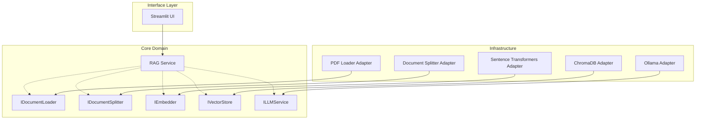

# 🌱 ESG Insight RAG Assistant

A RAG application for querying complex ESG reports —
turning dense sustainability PDFs into an interactive Q&A interface.

**Python:** 3.11 | **Architecture:** Hexagonal (Clean Architecture) | **LLM:** Mistral via Ollama

## 📹 Demo
[▶ Watch the demo](https://www.loom.com/share/337e70ef92c7402c8dafa58ebed20587)

---

## 🏗️ Architecture

This project follows **Hexagonal Architecture (Ports & Adapters)**.

- The **Core Domain (`RagService`)** defines the business logic.
- **Ports (interfaces)** define contracts.
- **Adapters** implement those contracts for external services.



---

## 🧠 Design Decisions

### Why Hexagonal Architecture?
Most RAG tutorials are monolithic scripts. I structured this project with explicit Ports and Adapters so that the core `RagService` has zero knowledge of external tools. Swapping ChromaDB for Pinecone, or Mistral for GPT-4, requires only a new Adapter — the domain logic stays untouched. It also means the business logic is fully testable by mocking adapters, without needing a real database or LLM running.

### Why no LangChain?
I built the pipeline directly using `chromadb`, `sentence-transformers`, and `ollama`. This was a deliberate choice: LangChain abstracts away the mechanics that matter — vector math, prompt construction, retrieval logic. Building it manually proves I understand *why* RAG works, not just how to assemble it.

### Why Mistral via Ollama?
Zero-cost local inference — no API keys, no usage limits, fully self-contained. Anyone can clone and run it without configuration overhead.

### A tradeoff I made consciously
For text splitting, I chose recursive character splitting with a sliding window (chunk size 1000, step 800, 200-char overlap) over semantic splitting. Semantic splitting is more precise but slow and expensive. The overlap ensures answers that fall at chunk boundaries are still captured in full — and the embeddings model handles semantic meaning anyway, making exact paragraph boundaries less critical.

### What surprised me
Real-world PDFs are messy — tables of contents, inconsistent newlines, mixed formatting. My instinct was to write preprocessing logic to clean them. I held back and tested first: the embeddings model is robust enough that a noisy TOC vector is still mathematically distinct from a carbon emissions paragraph. I learned not to over-engineer preprocessing when the downstream model is resilient.

---


## 🚀 Getting Started

### Prerequisites
- Python 3.11+
- Homebrew (Mac users)
- Ollama

### 1️⃣ Install Dependencies

```bash
# Install uv
curl -LsSf https://astral.sh/uv/install.sh | sh

# Create virtual environment
uv venv --python 3.11
source .venv/bin/activate

# Install dependencies
uv pip install -r requirements.txt
```

### 2️⃣ Setup Local LLM

```bash
# Install Ollama
brew install ollama

# Download Mistral model
ollama pull mistral

# Start server
ollama serve
```

Keep this running in another terminal.

### 3️⃣ Run the Application

```bash
streamlit run src/ui/app.py
```

Open `http://192.168.1.3:8501`

---

## 💡 Usage

**Upload** a PDF ESG report (any published sustainability report works).

> 💡 **Need a sample?** Try the [Apple Environmental Progress Report 2025](https://www.apple.com/environment/pdf/Apple_Environmental_Progress_Report_2025.pdf) — free to download.

**Process** — the system automatically extracts text, creates embeddings, and stores vectors.

**Chat** — ask natural language questions:

```
What are the company's carbon emission targets?
How does the company approach supply chain transparency?
```

The assistant retrieves relevant sections and generates a grounded answer.

---

## 📄 License

This project is for portfolio and demonstration purposes.

---

## 👩‍💻 Author

**Salma EL ANIGRI** — Applied AI Engineer (NLP/LLM)